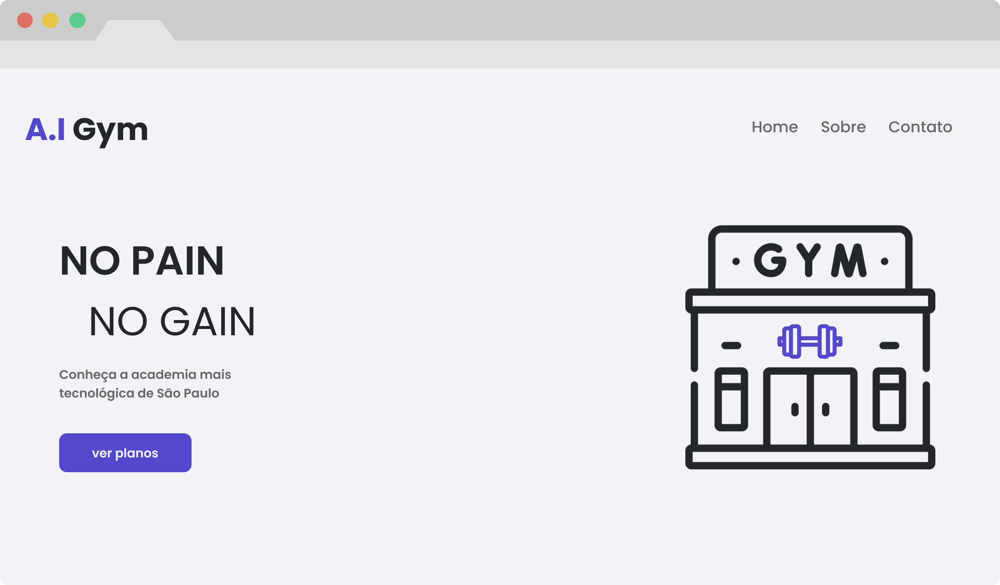

# A.I Gym

<h5> Seja bem-vindo a academia do momento! Na A.I Gym, você terá toda a infraestrutura e suporte necessário 
<br> para o seu desenvolvimento. 
</h5>

<br>



### Instalação

1. Clonar o repositório
   ```sh
   git clone https://github.com/lucasamadeuu/A.I-Gym.git
   ```
2. Instalar pacotes NPM
   ```sh
   npm install
   ```
   
3. Iniciar o projeto
   ```sh
   npm run dev
   ```

